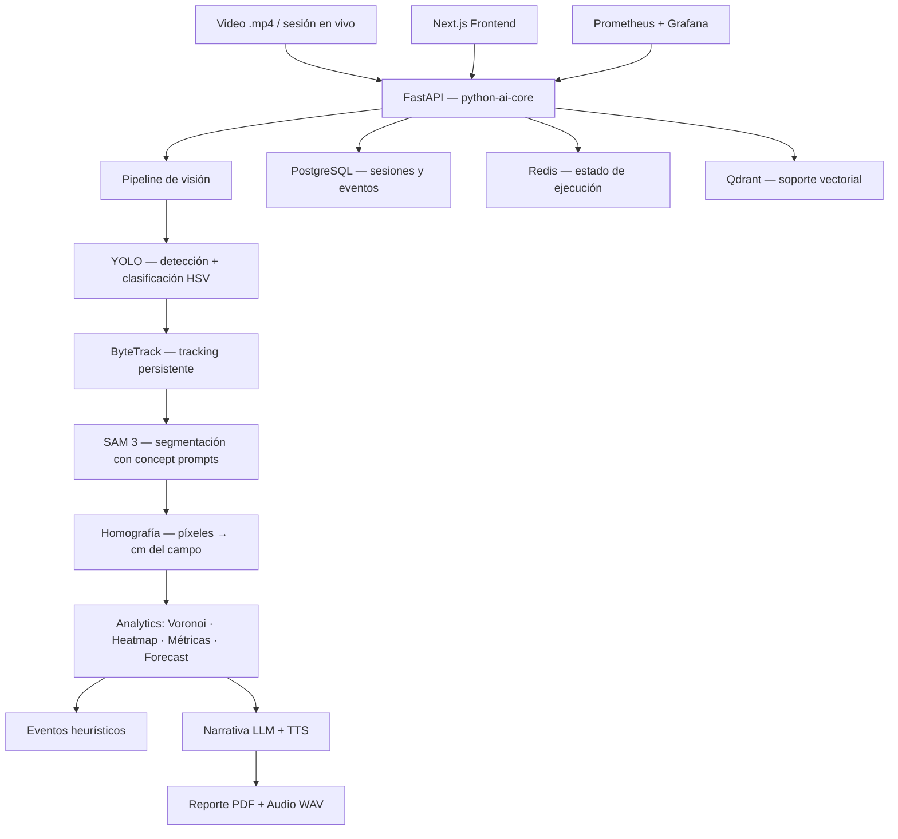

# SAMurAI FutBotMX

**Copa FutBotMX — Reto Visión por Computadora**
Secihti · Meta · Centro

---

El Mundial de Fútbol 2026 llega a México. Antes de que la pelota ruede en los estadios, una generación de robots ya disputa partidos con la misma intensidad táctica que los equipos humanos. **SAMurAI FutBotMX** convierte esos partidos en sesiones analíticas completas: segmenta cada elemento del campo con SAM 3, rastrea trayectorias cuadro a cuadro, calcula métricas espaciales y produce un resumen narrado en voz por inteligencia artificial.

La plataforma responde directamente al reto de la convocatoria: usar **SAM 3 (Segment Anything Model 3)** para segmentar, rastrear y analizar video de fútbol robótico de forma que aporte valor real a la comprensión del juego.

---

## Innovación sobre SAM 3

La convocatoria premia cómo cada equipo extiende las capacidades de SAM 3. Esta solución introduce tres líneas de innovación:

### 1. Prompts de concepto derivados del detector

A diferencia de flujos que solo pasan bounding boxes a SAM, aquí el clasificador HSV del detector YOLO asigna equipo a cada robot antes de invocar la segmentación. Eso permite construir prompts de texto abiertos como `"blue robot"`, `"red robot"` o `"soccer ball"` que SAM 3 entiende como conceptos de vocabulario abierto, logrando máscaras más coherentes con la identidad semántica del objeto.

```
YOLO bbox + clasificación HSV → concepto de texto → SAM 3 (bbox + text prompt) → máscara pixel-perfect
```

### 2. Integración con ByteTrack para identidad persistente

SAM 3 trabaja por frame. ByteTrack mantiene identidades a través del tiempo. La combinación permite que la máscara de un robot persista aunque salga del encuadre o sea ocluido, y que las métricas acumuladas (distancia recorrida, zona de influencia) sean coherentes durante toda la sesión.

### 3. Post-procesamiento geométrico completo

Las máscaras de SAM 3 alimentan un pipeline de análisis espacial:

- **Homografía planar** → coordenadas de píxel a centímetros reales del campo
- **Diagramas de Voronoi** → control territorial por equipo
- **Mapas de calor** → acumulación de ocupación espacial
- **Forecast de trayectoria** → predicción corta de movimiento por objeto
- **Detección heurística de eventos** → pases, tiros, intercepciones, colisiones

---

## Qué produce el sistema

Una sesión procesada entrega:

| Artefacto | Descripción |
| :--- | :--- |
| Trayectorias en tiempo real | Posición proyectada al campo en centímetros, frame a frame |
| Métricas de posesión | Proximidad al balón y control de zona por equipo |
| Mapas de calor | Ocupación espacial acumulada durante el partido |
| Diagramas de Voronoi | Dominio territorial por frame |
| Eventos detectados | Pases, tiros, intercepciones y colisiones con timestamp |
| Resumen narrativo | Texto generado por LLM (Anthropic Claude / OpenAI / Google Gemini) |
| Audio WAV | Narración sintetizada con piper-tts en español mexicano |
| Reporte PDF | Resumen completo con estadísticas, eventos y visualizaciones |

---

## Arquitectura



### Pipeline técnico paso a paso

```
Frame de video
  └─ YOLO (yolov8*.pt)
       ├─ Detección de robots y balón
       └─ Clasificación de equipo por histograma HSV
            └─ ByteTrack
                 ├─ Asignación de ID persistente
                 └─ SAM 3 (bbox + text prompt por concepto)
                      └─ Máscara pixel-perfect
                           └─ Homografía H ∈ ℝ³ˣ³
                                └─ Coordenadas (x_cm, y_cm)
                                     ├─ Métricas: posesión, velocidad, distancia
                                     ├─ Voronoi: V(pᵢ) = {x | d(x,pᵢ) ≤ d(x,pⱼ), ∀j≠i}
                                     ├─ Heatmap: acumulación de ocupación
                                     ├─ Forecast: diferencias finitas de primer orden
                                     └─ Eventos: heurísticas sobre trayectorias
```

---

## Requisitos de hardware y software

### Hardware recomendado

| Configuración | Perfil SAM 3 | VRAM | Observación |
| :--- | :--- | :--- | :--- |
| CPU únicamente | `tiny` (~40 MB) | — | Funcional, más lento |
| GPU ≥ 2 GB VRAM | `small` (~185 MB) | 2 GB | Recomendado para demos |
| GPU ≥ 4 GB VRAM | `base` (~375 MB) | 4 GB | Calidad media-alta |
| GPU ≥ 8 GB VRAM | `large` (~850 MB) | 8 GB | Máxima calidad |

`SAM_MODEL_SIZE=auto` detecta la GPU disponible y elige el perfil automáticamente.

### Software

- Docker Engine ≥ 24 y Docker Compose v2
- NVIDIA Container Toolkit (opcional, solo si hay GPU)
- Git

No se requiere instalar Python, Node.js ni dependencias de visión directamente en el host. Todo corre en contenedores.

---

## Arranque rápido

```bash
# 1. Clonar el repositorio
git clone <url-del-repositorio>
cd V8

# 2. Configurar variables de entorno
./samurai-futbot.sh env-setup
# Editar .env con las claves de API (LLM_PROVIDER, ANTHROPIC_API_KEY, etc.)

# 3. Construir imágenes
./samurai-futbot.sh build

# 4. Levantar el stack
./samurai-futbot.sh up

# 5. Verificar servicios
./samurai-futbot.sh status
```

El frontend queda disponible en `http://localhost:3000` y la API en `http://localhost:8000`.

### Con GPU y observabilidad

```bash
docker compose --profile observability --profile gpu up -d
```

### Detener todo

```bash
./samurai-futbot.sh down
```

---

## Reproducir un análisis

1. Abre `http://localhost:3000`.
2. Selecciona **Modo video** y sube un archivo `.mp4` de partido de la Copa FutBotMX.
3. El pipeline corre en segundo plano. El progreso se muestra en tiempo real.
4. Al finalizar, accede al reporte en `/report/{session_id}` o descarga el PDF y el audio WAV desde la misma interfaz.

Para sesiones en vivo, selecciona **Modo live** y registra eventos manualmente durante el partido.

---

## Variables de entorno principales

| Variable | Descripción | Valores |
| :--- | :--- | :--- |
| `LLM_PROVIDER` | Proveedor para narración | `anthropic`, `openai`, `google` |
| `ANTHROPIC_API_KEY` | Clave Claude (Anthropic) | — |
| `OPENAI_API_KEY` | Clave OpenAI | — |
| `GOOGLE_API_KEY` | Clave Google Gemini | — |
| `SAM_MODEL_SIZE` | Perfil de SAM 3 | `auto`, `tiny`, `small`, `base`, `large` |
| `YOLO_MODEL` | Checkpoint YOLO | `yolov8n.pt`, `yolov8s.pt`, etc. |
| `SAM_FRAME_SKIP` | Ejecutar SAM 3 cada N frames | entero, default `4` |
| `TTS_VOICE` | Voz TTS | `es_MX-claude-medium` |
| `NEXT_PUBLIC_API_BASE_URL` | URL pública del backend | `http://localhost:8000/api/v1` |

El archivo `.env.example` contiene todas las variables con valores por defecto seguros para desarrollo local.

---

## Servicios del stack

| Servicio | Puerto | Función |
| :--- | :--- | :--- |
| Frontend Next.js | `3000` | Interfaz principal |
| Backend FastAPI | `8000` | API, pipeline, reportes |
| PostgreSQL | `5432` | Persistencia relacional |
| Redis | `6379` | Estado de ejecución en tiempo real |
| Qdrant | `6333`, `6334` | Soporte vectorial |
| Prometheus | `9090` | Métricas (perfil `observability`) |
| Grafana | `3001` | Dashboards (perfil `observability`) |

---

## Resultados

> Capturas de pantalla, GIFs y ejemplos de salida se agregan en esta sección conforme se generan sesiones de prueba sobre los videos oficiales de la Copa FutBotMX.

<!-- RESULTADOS: insertar capturas del frontend, heatmaps, Voronoi y reportes PDF aquí -->

---

## Reel de Instagram

<!-- REEL: insertar enlace al reel publicado aquí -->

---

## Mapa del repositorio

```text
V8/
├── backend/
│   ├── ollama-exporter/
│   └── python-ai-core/
│       ├── app/
│       │   ├── analytics/      # heatmap, voronoi, eventos, métricas
│       │   ├── api/routes/     # endpoints FastAPI
│       │   ├── core/           # estado en memoria
│       │   ├── db/             # modelos, repositorio, migraciones
│       │   ├── forecast/       # predicción de trayectorias
│       │   ├── ingestion/      # pipeline y fuentes de video
│       │   ├── narrative/      # LLM y TTS
│       │   ├── reports/        # generación de PDF y audio
│       │   └── vision/         # detector, tracker, SAM 3, homografía
│       └── alembic/            # migraciones de base de datos
├── docs/
│   ├── Logic.md                # flujo funcional y reglas de negocio
│   └── Technic.md              # arquitectura técnica detallada
├── frontend/
│   └── nextjs-frontend/
├── grafana/
├── prometheus/
├── docker-compose.yml
├── samurai-futbot.sh
└── .env.example
```

Documentación extendida:
- [Lógica funcional y de producto](docs/Logic.md)
- [Arquitectura técnica e infraestructura](docs/Technic.md)
- [Artículo de referencia: SAM 3 (arXiv:2511.16719)](docs/1-s2.0-S1077314226000299-main(1).PDF)

---

## Fundamento académico

### Homografía planar

La proyección del plano de imagen al plano del campo se modela con una homografía $H \in \mathbb{R}^{3 \times 3}$:

$$\begin{bmatrix} x'_c \\ y'_c \\ w \end{bmatrix} = H \begin{bmatrix} x_{px} \\ y_{px} \\ 1 \end{bmatrix}, \qquad x_{cm} = \frac{x'_c}{w}, \quad y_{cm} = \frac{y'_c}{w}$$

Implementado en `app/vision/homography.py`.

### Control territorial — Voronoi

La región de Voronoi del robot $p_i$ dentro del conjunto $P$ de posiciones proyectadas:

$$V(p_i) = \{x \in \mathbb{R}^2 \mid d(x, p_i) \le d(x, p_j),\ \forall j \ne i\}$$

La suma de áreas por equipo estima dominancia espacial. Implementado en `app/analytics/voronoi.py`.

### Velocidad y distancia

$$v_t = \frac{\sqrt{(x_t-x_{t-1})^2 + (y_t-y_{t-1})^2}}{t_t - t_{t-1}}, \qquad D = \sum_{t=1}^{T} \sqrt{(x_t-x_{t-1})^2 + (y_t-y_{t-1})^2}$$

Implementado en `app/analytics/metrics.py` y `app/forecast/trajectory.py`.

---

## Tecnologías base

| Componente | Tecnología | Referencia |
| :--- | :--- | :--- |
| Segmentación | SAM 3 (Segment Anything with Concepts) | arXiv:2511.16719 |
| Detección | Ultralytics YOLOv8 | — |
| Tracking | ByteTrack (via Roboflow Supervision) | — |
| Backend API | FastAPI | — |
| Frontend | Next.js | — |
| Síntesis de voz | piper-tts (`es_MX`) | — |
| Generación de reportes | fpdf2 | — |
| Base de datos | PostgreSQL + Redis + Qdrant | — |
| Observabilidad | Prometheus + Grafana | — |

---

## Créditos y licencia

Proyecto desarrollado como entregable para el **Reto Visión por Computadora, Copa FutBotMX**, organizado por la Secretaría de Ciencia, Humanidades, Tecnología e Innovación (Secihti) en colaboración con Meta y Centro.

El modelo SAM 3 es propiedad de Meta AI y se distribuye bajo la SAM License. Los participantes son responsables de cumplir con sus términos.

Este repositorio se distribuye bajo licencia **MIT** — ver [`LICENSE`](LICENSE).

Las bibliotecas de terceros utilizadas (Ultralytics, Roboflow Supervision, ByteTrack, fpdf2, piper-tts) se atribuyen conforme a sus licencias originales. El rol de cada dependencia en el pipeline está descrito en [`docs/Technic.md`](docs/Technic.md).
