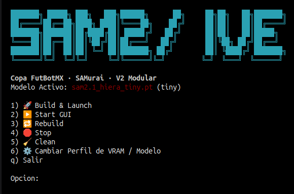
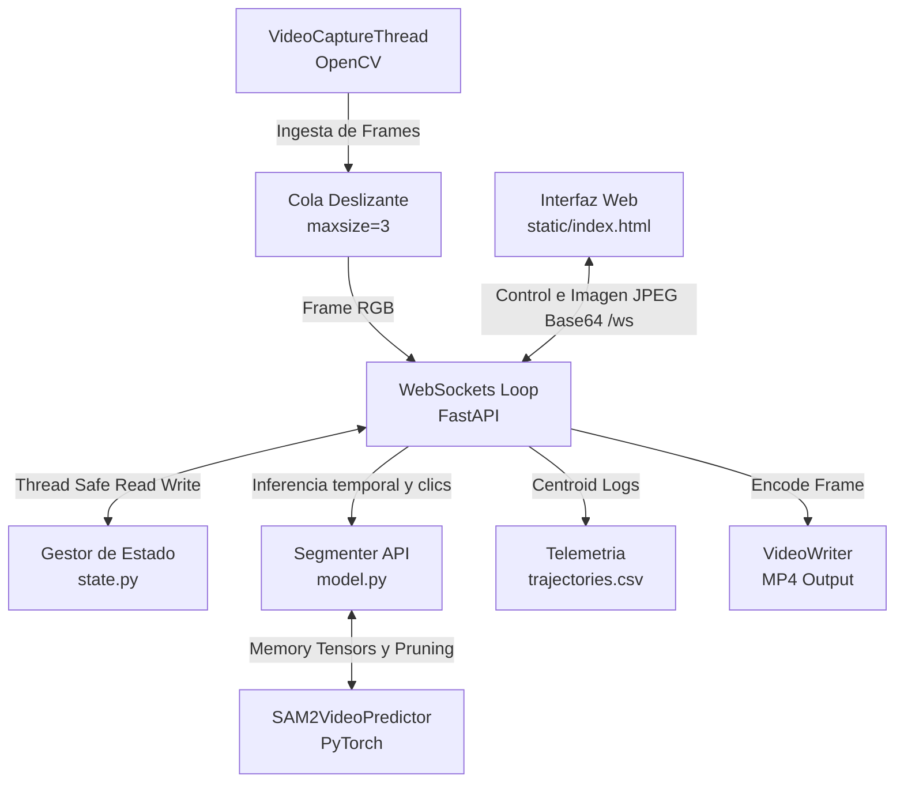

# SAM 2 Live — Arquitectura Modular y Producción de Video


<p align="center">
  
</p>


> **Proyecto de producción e inferencia interactiva optimizada para Copa FutBotMX · SAMurai**
>
> Una solución industrial y contenedorizada en Docker para la segmentación y seguimiento interactivo de **múltiples objetos** en transmisiones de video en vivo utilizando **Segment Anything Model 2.1 (SAM 2)** de Meta AI, acelerado por hardware NVIDIA CUDA.


---


## 📌 Índice

- [📋 Resumen Ejecutivo y Arquitectura](#resumen-ejecutivo-y-arquitectura)
  - [Flujo de Datos del Sistema](#flujo-de-datos-del-sistema)
- [🛠️ Stack Tecnológico](#stack-tecnológico)
- [🚀 Características Clave y Novedades de la v6](#características-clave-y-novedades-de-la-v6)
  - [1. Inferencia Temporal en Memoria sin E/S de Disco (Zero-Disk I/O)](#1-inferencia-temporal-en-memoria-sin-es-de-disco-zero-disk-io)
  - [2. Seguimiento Multiobjeto (Multi-Object Tracking - MOT)](#2-seguimiento-multiobjeto-multi-object-tracking---mot)
  - [3. Blindaje de Memoria y Prevención de CUDA OOM (Estabilidad 24/7)](#3-blindaje-de-memoria-y-prevención-de-cuda-oom-estabilidad-247)
  - [4. Modos de Renderizado de Producción y Corrección de Bugs](#4-modos-de-renderizado-de-producción-y-corrección-de-bugs)
  - [5. Telemetría de Trayectoria CSV](#5-telemetría-de-trayectoria-csv)
- [📁 Estructura Modular del Proyecto](#estructura-modular-del-proyecto)
- [🛠️ Especificaciones de la API de Control (HTTP / WS)](#especificaciones-de-la-api-de-control-http--ws)
  - [Endpoints HTTP (REST)](#endpoints-http-rest)
  - [Protocolo de Comunicación WebSocket (/ws)](#protocolo-de-comunicación-websocket-ws)
- [⚙️ Requisitos del Sistema e Instalación](#requisitos-del-sistema-e-instalación)
  - [Requisitos de Hardware](#requisitos-de-hardware)
  - [🧠 Adaptabilidad de Modelo según Hardware (VRAM)](#-adaptabilidad-de-modelo-según-hardware-vram)
  - [🖥️ Opciones de Menú de la CLI (sam2_live.sh)](#-opciones-de-menú-de-la-cli-sam2_livesh)
  - [Guía Rápida de Despliegue](#guía-rápida-de-despliegue)
- [🎮 Operaciones en Interfaz de Usuario y Atajos](#operaciones-en-interfaz-de-usuario-y-atajos)

---


## 📋 Resumen Ejecutivo y Arquitectura

**SAM 2 Live** representa un proyecto integral enfocado en la **transmisión en vivo (broadcast)** y el **análisis deportivo de alta fidelidad**. Mediante una arquitectura completamente desacoplada con hilos de procesamiento de video e intercambios síncronos sobre WebSockets, el sistema procesa video a alta tasa de frames sin latencia acumulativa.

El sistema ahora soporta el seguimiento de múltiples objetos de forma concurrente, genera archivos de telemetría física en tiempo real (coordenadas de centroides y porcentaje de área), proporciona herramientas de composición visual avanzadas (Chroma Key, silueta binaria y difuminado de fondo por hardware) y cuenta con un blindaje activo de prevención de fallos por falta de memoria (OOM).


---


### Flujo de Datos del Sistema




---


## 🛠️ Stack Tecnológico

El proyecto está diseñado bajo una arquitectura robusta y desacoplada para lograr un rendimiento óptimo de inferencia en tiempo real:

*   **Contenedorización y Entorno (Docker):**
    *   **Imagen Base:** `pytorch/pytorch:2.5.1-cuda12.4-cudnn9-runtime` que proporciona un entorno preconfigurado y optimizado de Deep Learning.
    *   **Aceleración de Hardware:** Integración nativa con NVIDIA CUDA 12.4 y cuDNN 9 mediante el runtime de NVIDIA Docker (`--gpus all`).
    *   **Librerías del Sistema:** FFmpeg para la captura/codificación de streams y OpenCV-Python-Headless para control de flujos de frames.

*   **Backend (Python / FastAPI):**
    *   **Servidor ASGI:** FastAPI ejecutándose sobre Uvicorn para una comunicación HTTP/WS asíncrona de alto rendimiento.
    *   **Modelos de Inferencia / ML:** Compilación directa de Segment Anything Model 2.1 (SAM 2.1) de Meta AI sobre PyTorch 2.5.1.
    *   **Procesamiento Gráfico:** OpenCV, Pillow y NumPy para la composición matricial rápida de máscaras, renderizado de Chroma Key y cálculo de desenfoques de fondo (Gaussian Blur).
    *   **Transmisión Bidireccional:** WebSockets para el intercambio simultáneo de metadatos (clics, configuraciones, telemetría) y fotogramas codificados en Base64.

*   **Frontend (HTML5 / JS / CSS Vanilla):**
    *   **Lógica:** JavaScript plano (ES6+) libre de frameworks para procesamiento liviano y rendering en Canvas de HTML5 con bajísima latencia.
    *   **Estética:** CSS Vanilla diseñado bajo la estética "dark glassmorphism", con animaciones fluidas y tipografías Outfit y Space Mono cargadas desde Google Fonts.
    *   **Interacciones:** Manejo interactivo de clics (izquierdo para incluir área, derecho para excluir), teclas de atajo rápidas y sincronización instantánea de estados del stream.

*   **Base de Datos y Almacenamiento (RAM / CSV):**
    *   **Arquitectura In-Memory (Zero DB / RAM):** Todo el estado dinámico (objetos creados, colores, histórico de clics) se gestiona de forma volátil y síncrona en memoria a través de una clase thread-safe en [state.py](file:///home/humbert/Docker/SAM%202/V8/app/state.py). Esto evita cuellos de botella e I/O en disco durante la inferencia.
    *   **Persistencia Física:** Exportación secuencial de trayectorias físicas calculadas (centroides, área y porcentaje) directamente en un archivo estructurado `CSV` en `$WORKSPACE/outputs/trajectories.csv`.
    *   **Configuración del Sistema:** Cache local de perfiles e inicialización a través del script de bash y del archivo `sam2_env.sh`.


---


## 🚀 Características Clave y Novedades de la v6


### 1. Inferencia Temporal en Memoria sin E/S de Disco (Zero-Disk I/O)
Para evitar los cuellos de botella severos que causa guardar frames en disco durante transmisiones en tiempo real, el módulo de segmentación implementa un hack de inicialización directa en RAM:
*   El [Segmenter](file:///home/humbert/Docker/SAM%202/V8/app/model.py) simula un directorio base en disco de memoria compartida (`/dev/shm/sam2_live`) que contiene un frame ficticio de 10x10 píxeles. Esto satisface el proceso de validación estructural inicial del método `init_state` del `SAM2VideoPredictor` de Facebook.
*   Posteriormente, cada nuevo frame capturado por la cámara se redimensiona a $1024 \times 1024$ píxeles, se normaliza y se inyecta directamente como un tensor de PyTorch (`torch.Tensor`) en la lista interna `inference_state["images"]`.
*   Esto elimina por completo el uso de disco duro para almacenamiento de buffer temporal, logrando latencias de inferencia de nivel microsegundo para la etapa de preparación.


### 2. Seguimiento Multiobjeto (Multi-Object Tracking - MOT)
El sistema migró de un único objeto a una estructura asociativa en [InferenceState](file:///home/humbert/Docker/SAM%202/V8/app/state.py).
*   **Gestor de Objetos:** La interfaz web ahora incluye un panel para crear nuevos objetos con un nombre descriptivo y colores RGB asignados aleatoriamente.
*   **Clics por Objeto:** Se puede alternar cuál es el objeto activo desde la GUI. Los clics añadidos al canvas se asignan al objeto seleccionado en ese instante.
*   **Propagación Conjunta:** Al llamar a `track_step` en [model.py](file:///home/humbert/Docker/SAM%202/V8/app/model.py), el predictor calcula las máscaras de todos los objetos registrados en paralelo utilizando los logits del banco de memoria unificado de SAM 2.


### 3. Blindaje de Memoria y Prevención de CUDA OOM (Estabilidad 24/7)
La acumulación exponencial de embeddings en el banco de memoria del predictor de video suele causar cuellos de botella de VRAM y caídas por OOM (Out Of Memory) tras pocos minutos de operación. En la **v6** se aplicaron cuatro técnicas de mitigación:
1.  **Poda Deslizante de Historial (`prune_state`):** Tras procesar cada frame, se invoca una función que purga los estados pasados fuera de una ventana móvil de **15 fotogramas**. Esta función pone a `None` los elementos expirados de `inference_state["images"]` y elimina las llaves de cache de `cached_features`, `output_dict` y `output_dict_per_obj`.
2.  **Fragmentación CUDA:** Se carga la variable de entorno `PYTORCH_CUDA_ALLOC_CONF="expandable_segments:True"` al inicializar la aplicación en [main.py](file:///home/humbert/Docker/SAM%202/V8/app/main.py) para que PyTorch expanda dinámicamente los bloques de memoria sin fragmentar la memoria virtual de la GPU.
3.  **Recolección de Basura Periódica:** Cada 30 iteraciones del bucle de WebSocket, el sistema ejecuta de forma síncrona `gc.collect()` en Python y `torch.cuda.empty_cache()` en la GPU para devolver VRAM libre al sistema operativo.
4.  **Optimización del Endpoint `/restart`:** Se eliminó la re-instanciación de pesos del modelo durante el reinicio suave. Ahora se limpian únicamente los puntos de inferencia e índices de frame, lo que previene fugas de memoria al cambiar de fuente o reiniciar la segmentación.


### 4. Modos de Renderizado de Producción y Corrección de Bugs
*   **Normal:** Superpone la máscara de color sobre el video original con opacidad graduable e incluye trazado de contornos vectoriales.
*   **Chroma Key:** Sustituye el fondo por un verde croma puro (`RGB [0, 255, 0]`) mientras conserva la imagen real del objeto segmentado, permitiendo su integración directa en mezcladores de video como OBS Studio o vMix.
*   **Silueta (Alpha Mask):** Genera una máscara binaria nítida (objeto en blanco, fondo en negro).
    *   *Resolución de Bug Crítico:* En versiones previas, la composición del canvas binario mediante `np.where` generaba un arreglo implícito de tipo `int32` al usar la lista de enteros `[255, 255, 255]`. Esto provocaba que la función `cv2.cvtColor` de OpenCV fallara al intentar codificar el frame en JPEG. Se solucionó pre-definiendo la máscara de reemplazo como un arreglo `np.uint8` (`np.array([255, 255, 255], dtype=np.uint8)`) y forzando un casteo final a `.astype(np.uint8)`.
*   **Difuminado de Fondo (Gaussian Blur):** Aplica un filtro Gaussian Blur dinámico en las zonas del frame que no contienen objetos rastreados, manteniendo el foco del presentador u objeto deportivo con un slider de ajuste de 3px a 51px.
*   **Grabador de Transmisión:** El sistema codifica la salida visual directamente a archivos de video `.mp4` en el directorio `/app/outputs/` de forma síncrona sin interferir con la velocidad de fotogramas del WebSocket.


### 5. Telemetría de Trayectoria CSV
Los datos geométricos de cada objeto se registran fotograma a fotograma en [outputs/trajectories.csv](file:///home/humbert/Docker/SAM%202/V8/app/main.py#L31). El archivo incluye las siguientes columnas:
*   `timestamp`: Época unix en segundos de alta precisión.
*   `object_id`: Identificador numérico único del objeto.
*   `object_name`: Etiqueta descriptiva del objeto.
*   `centroid_x` / `centroid_y`: Coordenadas del centro de masa de la máscara, normalizadas de `0.0` a `1.0` relativo al tamaño de la pantalla.
*   `area_px`: Cantidad absoluta de píxeles abarcados por la máscara.
*   `area_pct`: Porcentaje de la pantalla ocupado por el objeto.


---


## 📁 Estructura Modular del Proyecto

La base del código fuente se organiza de la siguiente manera:

*   [sam2_live.sh](file:///home/humbert/Docker/SAM%202/V8/sam2_live.sh): Script controlador Bash. Administra el ciclo de vida del contenedor Docker, monta cámaras de video `/dev/video*`, crea directorios y descarga checkpoints del modelo.
*   [Dockerfile](file:///home/humbert/Docker/SAM%202/V8/Dockerfile): Imagen Docker basada en PyTorch Runtime con CUDA 12.4. Instala dependencias del sistema (FFmpeg, OpenCV) y compila SAM 2 desde el repositorio oficial de Meta.
*   [app/main.py](file:///home/humbert/Docker/SAM%202/V8/app/main.py): Orquestador del servidor web ASGI (FastAPI), bucle de comunicación WebSocket, e hilo de ingesta asíncrona de video `VideoCaptureThread`.
*   [app/model.py](file:///home/humbert/Docker/SAM%202/V8/app/model.py): Encapsulador de la API de SAM 2. Controla la inicialización de `SAM2VideoPredictor`, la poda de memoria temporal de embeddings y la generación automática.
*   [app/state.py](file:///home/humbert/Docker/SAM%202/V8/app/state.py): Almacenamiento thread-safe del estado de la aplicación. Maneja objetos múltiples, configuraciones de renderizado y cálculo de estadísticas.
*   [app/config.py](file:///home/humbert/Docker/SAM%202/V8/app/config.py): Variables de entorno globales del servidor y del modelo (Checkpoint paths, FPS Cap, Puertos).
*   [static/index.html](file:///home/humbert/Docker/SAM%202/V8/static/index.html): Cliente web desarrollado en HTML5/JS moderno con estética dark glassmorphism, controles interactivos, gestor de objetos y tabla de telemetría dinámica.


---


## 🛠️ Especificaciones de la API de Control (HTTP / WS)


### Endpoints HTTP (REST)
*   **`POST /config`**: Actualiza parámetros globales de renderizado o cambia la fuente de video.
    ```json
    {
      "mode": "track",
      "render_mode": "chroma_key",
      "blur_background": true,
      "blur_strength": 25,
      "opacity": 0.50,
      "source": "/inputs/soccer_game.mp4"
    }
    ```

*   **`POST /object/add`**: Registra un nuevo objeto en el gestor de estados.
    ```json
    {
      "id": 2,
      "name": "Balon",
      "color": [255, 255, 0]
    }
    ```

*   **`POST /object/remove`**: Remueve un objeto y resetea el tracking en caliente.
    ```json
    { "id": 2 }
    ```
*   **`GET /status`**: Devuelve información en tiempo real del hardware, FPS y objetos.
*   **`POST /restart`**: Limpia los puntos del predictor de video y resetea el tracker sin recargar el modelo de la GPU.
*   **`POST /hard-restart`**: Fuerza la detención y reinicio del contenedor completo (útil si hay bloqueos del controlador de cámara).


### Protocolo de Comunicación WebSocket (`/ws`)
La comunicación de baja latencia se realiza a través de un canal bidireccional:
*   **Cliente ➡️ Servidor (JSON):**
    *   Clicks interactivos: `{ "type": "click", "x": 640, "y": 360, "button": "left" }`
    *   Limpia puntos: `{ "type": "clear" }` o `{ "type": "clear_all" }`
    *   Sincronización de configuraciones: `{ "type": "config", "mode": "track", "is_recording": true }`
*   **Servidor ➡️ Cliente (JSON):**
    *   Payload de transmisión:
        ```json
        {
          "frame": "data:image/jpeg;base64,...",
          "fps": 19.5,
          "mode": "track",
          "auto_count": 0,
          "telemetry": [
            {
              "id": 1,
              "name": "Jugador 1",
              "color": [0, 230, 100],
              "cx": 0.5214,
              "cy": 0.3341,
              "area_px": 14205,
              "area_pct": 1.54
            }
          ]
        }
        ```


---


## ⚙️ Requisitos del Sistema e Instalación


### Requisitos de Hardware
*   **GPU:** Tarjeta gráfica NVIDIA con soporte CUDA (VRAM requerida según el tamaño de modelo seleccionado, mínimo ~2 GB).
*   **OS:** GNU/Linux (Ubuntu 20.04 LTS o superior recomendado para mapeo directo de cámaras).
*   **NVIDIA Container Toolkit:** Instalado y configurado en el demonio de Docker.


### 🧠 Adaptabilidad de Modelo según Hardware (VRAM)
SAM 2 Live permite configurar y arrancar el contenedor con distintos checkpoints de Segment Anything Model 2.1 (Hiera), adaptándose a las capacidades de tu GPU para optimizar el balance entre velocidad (FPS de inferencia) y precisión (fidelidad en el seguimiento de contornos):

| Perfil de Modelo | Checkpoint | Consumo VRAM Aprox. | Características / Escenario Recomendado |
| :--- | :--- | :--- | :--- |
| **Tiny** (`sam2.1_hiera_t`) | `sam2.1_hiera_tiny.pt` | **~2 - 4 GB** | Inferencia ultra rápida. Diseñado para GPUs integradas, laptops y desarrollo local rápido. |
| **Small** (`sam2.1_hiera_s`) | `sam2.1_hiera_small.pt` | **~4 - 6 GB** | Excelente balance general entre frames por segundo y precisión de máscaras. |
| **Base+** (`sam2.1_hiera_b+`) | `sam2.1_hiera_base_plus.pt` | **~6 - 8 GB** | Mayor resolución espacial en los contornos. Recomendado para GPUs de gama media en producción. |
| **Large** (`sam2.1_hiera_l`) | `sam2.1_hiera_large.pt` | **> 8 GB** | Máxima calidad y nitidez en segmentación. Consumo intensivo, recomendado para estaciones de trabajo con GPUs de gama alta. |

*Nota: Esta configuración se persiste localmente en `$HOME/sam2-live-v2/sam2_env.sh` y es consultada automáticamente al arrancar la aplicación.*


### 🖥️ Opciones de Menú de la CLI (`sam2_live.sh`)
El script controlador [`sam2_live.sh`](file:///home/humbert/Docker/SAM%202/V8/sam2_live.sh) provee un menú interactivo en bash para gestionar el ciclo de vida del contenedor Docker y sus dependencias:

*   **1) 🚀 Build & Launch:** Inicializa la estructura de directorios en el host (`checkpoints/`, `inputs/` y `outputs/`), descarga de forma automatizada los pesos oficiales del modelo de Meta correspondientes al perfil de VRAM activo si no están presentes, construye la imagen de Docker `sam2-live-v2:latest` inyectando el código actual, detiene instancias previas y arranca el contenedor con acceso completo a GPU (`--gpus all`) y a las cámaras USB detectadas (`/dev/video0` a `/dev/video2`).
*   **2) ▶️ Start GUI:** Arranca el contenedor de SAM 2 utilizando la imagen Docker existente en el host, sin reconstruirla de nuevo. Inicializa el modelo seleccionado y abre la aplicación en `http://localhost:7860`.
*   **3) 🔁 Rebuild:** Sincroniza el código fuente actual del backend (`app/`), los archivos de frontend (`static/`), scripts y Dockerfile hacia el workspace `$HOME/sam2-live-v2` y realiza un `docker build` para reconstruir la imagen. Útil para aplicar cambios y correcciones hechas en el código.
*   **4) 🛑 Stop:** Detiene ordenadamente el contenedor de Docker y elimina el contenedor `sam2-live-v2` liberando puertos y VRAM.
*   **5) 🧹 Clean:** Detiene y elimina el contenedor, borra la imagen de Docker creada (`sam2-live-v2:latest`) y elimina de forma definitiva el directorio del workspace (`$HOME/sam2-live-v2`). Solicita confirmación del usuario antes de proceder.
*   **6) ⚙️ Cambiar Perfil de VRAM / Modelo:** Permite cambiar el tamaño de modelo activo. Al cambiar de perfil, descarga el checkpoint de SAM 2.1 pertinente y sobreescribe el archivo `sam2_env.sh` con la configuración seleccionada.
*   **q) Salir:** Sale del menú interactivo de la CLI.


### Guía Rápida de Despliegue
1.  **Montar el espacio de trabajo:**
    Clona o copia los archivos del proyecto en la carpeta del host en `$HOME/sam2-live-v2`.
2.  **Arrancar el script interactivo:**
    ```bash
    bash sam2_live.sh
    ```
3.  **Selecciona la Opción `1` (Build & Launch):**
    El script creará automáticamente las carpetas `inputs/`, `outputs/` y `checkpoints/`, descargará el modelo Hiera seleccionado (por defecto Tiny), construirá la imagen Docker e iniciará el contenedor con acceso a la GPU y a los dispositivos de cámara `/dev/video0`, `/dev/video1`, y `/dev/video2`.
4.  **Uso de Fuentes Personalizadas:**
    *   Para procesar un video propio, colócalo en `$HOME/sam2-live-v2/inputs/mi_video.mp4` y en la interfaz web escribe en el campo de fuente `/inputs/mi_video.mp4`.
    *   Para cambiar a otra cámara conectada por USB, escribe el identificador de la cámara (por ejemplo, `1` para `/dev/video1`).


---


## 🎮 Operaciones en Interfaz de Usuario y Atajos

*   **Punto de Inclusión (Click Izquierdo):** Agrega un marcador verde en la pantalla para indicar que esa zona debe incluirse en la máscara de segmentación.
*   **Punto de Exclusión (Click Derecho):** Agrega un marcador rojo para recortar o eliminar secciones no deseadas del fondo o de otros objetos.
*   **Atajos de Teclado:**
    *   <kbd>C</kbd> : Limpia inmediatamente todos los puntos interactivos del **objeto activo**.
    *   <kbd>X</kbd> : Limpia todos los puntos de **todos los objetos** registrados y borra las máscaras visuales.
    *   <kbd>S</kbd> : Cambia instantáneamente al modo **Segment** (Inferencia estática interactiva).
    *   <kbd>T</kbd> : Cambia instantáneamente al modo **Track** (Seguimiento temporal dinámico).
    *   <kbd>Espacio</kbd> : Alterna la pausa del stream de video (congela el cuadro actual para permitir un marcado preciso de puntos).


---
