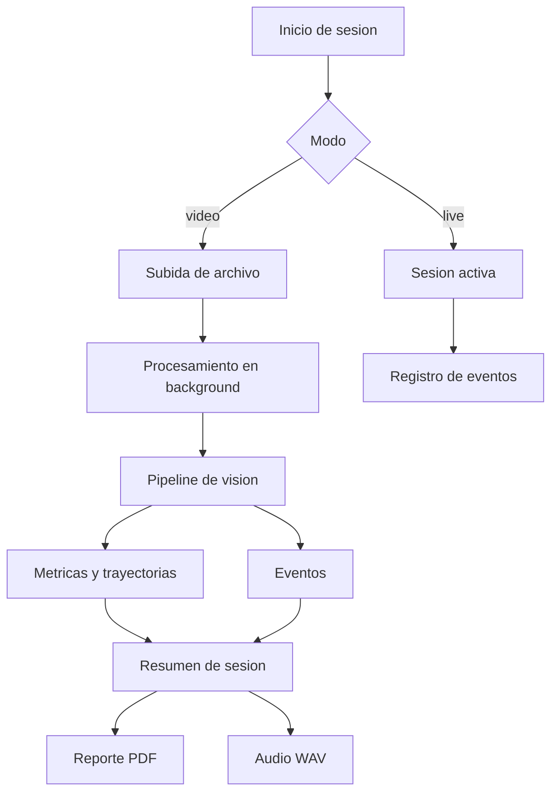

# Logica funcional y de producto

Este documento describe como se usa **SAMurAI FutBotMX**, que flujo sigue una sesion y que reglas funcionales convierten video y telemetria en metricas, eventos, reportes y audio.

No intenta explicar detalles de infraestructura. Para eso esta [Technic.md](Technic.md).

## Objetivo

El producto busca que una sesion de futbol robotico pueda analizarse de forma consistente desde dos entradas:

- un archivo de video
- una sesion en vivo con captura y registro de eventos

El resultado esperado es una sesion consultable con:

- estado de procesamiento
- trayectorias recientes con prediccion de movimiento
- metricas espaciales: posesion, velocidad, control territorial (Voronoi), mapas de calor
- eventos detectados automaticamente o registrados manualmente
- resumen narrativo generado por LLM
- artefactos de salida: audio WAV y reporte PDF

## Actores

Los documentos y pantallas del sistema estan pensados para tres perfiles:

- operador tecnico que inicia sesiones y revisa progreso
- analista o entrenador que consulta metricas y eventos
- desarrollador o PM que necesita entender el flujo del producto

## Modos de uso

| Modo | Entrada | Comportamiento principal | Salida |
| :--- | :--- | :--- | :--- |
| `video` | Archivo `.mp4`, `.mov`, `.avi`, `.mkv` | Crea una sesion, guarda el archivo y procesa en background | Reporte, audio, eventos y metricas |
| `live` | Sesion iniciada desde UI o API | Mantiene una sesion activa y permite registrar eventos | Estado operativo, eventos, metricas y cierre manual |

## Flujo funcional

## Reglas funcionales principales

### Sesiones

- Cada sesion tiene identificador unico, modo, estado, timestamps y referencia a la fuente cuando aplica.
- Una sesion de video pasa por un estado de procesamiento antes de considerarse completada.
- El historial muestra sesiones finalizadas.

### Ingesta de video

- Solo se aceptan archivos con extensiones soportadas por el endpoint de subida.
- El archivo se persiste en `backend/python-ai-core/data/uploads`.
- El procesamiento corre en segundo plano para no bloquear la respuesta HTTP.

### Telemetria de ejecucion

- El backend mantiene estado volatil por sesion en Redis.
- El resumen de sesion expone progreso, etapa actual, eventos pendientes y trayectorias recientes.
- El frontend puede consultar ese resumen para mostrar avance y datos operativos.

### Eventos

El pipeline de procesamiento ejecuta en secuencia: deteccion YOLO con clasificacion HSV de equipo → tracking ByteTrack → segmentacion SAM 3 con prompts de concepto texto → proyeccion homografica a coordenadas reales → calculo de metricas, eventos, heatmap, Voronoi y forecast de trayectoria.

Los eventos llegan por dos vias:

- deteccion heuristica durante el pipeline (pases, tiros, intercepciones, colisiones)
- registro manual a traves del endpoint de eventos

Los eventos se guardan con:

- tipo
- timestamp
- frame
- metadatos
- texto narrado opcional

### Metricas

Las metricas funcionales que el producto intenta exponer son:

- posesion o proximidad al balon
- trayectorias recientes
- ocupacion del espacio
- control territorial basado en Voronoi

La interpretacion exacta depende de la implementacion actual del backend y de la calidad de la deteccion sobre el video de entrada.

### Salidas

Cuando una sesion termina, el sistema puede producir:

- un resumen textual
- un PDF con resumen, estadisticas y eventos
- un archivo WAV de la sesion completa
- audio individual por evento

## Recorrido del usuario en el frontend

Las rutas visibles en `frontend/nextjs-frontend/src/app` reflejan el flujo actual:

| Ruta | Proposito |
| :--- | :--- |
| `/` | Entrada principal y seleccion de modo |
| `/live/setup` | Configuracion de sesion en vivo |
| `/video/setup` | Carga de video |
| `/session` | Vista principal de sesion |
| `/session/[panel]/[mode]` | Variantes de panel o modo de trabajo |
| `/report/[sessionId]` | Consulta del reporte de una sesion |
| `/history` | Historial de sesiones completadas |

## API funcional relevante

Los endpoints de sesiones concentran el comportamiento de producto:

- `GET /api/v1/sessions`
- `GET /api/v1/sessions/history`
- `POST /api/v1/sessions`
- `POST /api/v1/sessions/upload`
- `GET /api/v1/sessions/{session_id}`
- `GET /api/v1/sessions/{session_id}/report`
- `GET /api/v1/sessions/{session_id}/artifact`
- `GET /api/v1/sessions/{session_id}/audio`
- `POST /api/v1/sessions/{session_id}/events`
- `POST /api/v1/sessions/{session_id}/finalize`

## Supuestos y limites

- La calidad del resultado depende de la camara, la calibracion y la visibilidad de robots y balon.
- Algunas metricas y narrativas son aproximaciones operativas, no una verdad absoluta del partido.
- El repositorio contiene la base funcional; la madurez real de cada flujo debe validarse con pruebas sobre video y sesiones completas.
