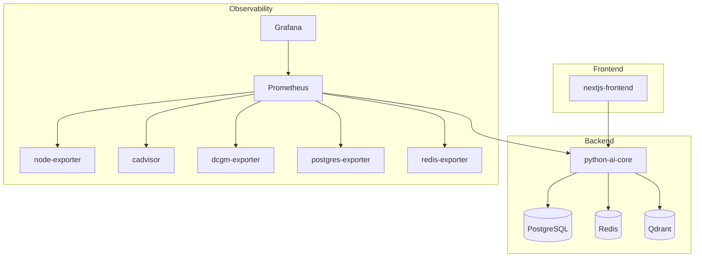

# Arquitectura tecnica e infraestructura

Este documento resume la estructura tecnica de **SAMurAI FutBotMX** con foco en servicios, datos, pipeline, API, configuracion y operacion local.

No cubre la narrativa de producto. Para eso esta [Logic.md](Logic.md).

## Vista general

El proyecto esta dividido en cuatro bloques:

- `frontend/nextjs-frontend`: interfaz Next.js
- `backend/python-ai-core`: API y pipeline de procesamiento
- `grafana/` y `prometheus/`: observabilidad
- `docker-compose.yml`: orquestacion local

## Topologia de servicios



## Redes y despliegue

`docker-compose.yml` define cuatro redes logicas:

- `frontend-net`
- `backend-net`
- `ai-net`
- `observability-net`

Tambien define volumenes persistentes para:

- PostgreSQL
- Redis
- Qdrant
- Grafana
- Prometheus

## Servicios del stack

| Servicio | Puerto | Funcion tecnica |
| :--- | :--- | :--- |
| `nextjs-frontend` | `3000` | Cliente web |
| `python-ai-core` | `8000` | API, sesiones, pipeline y reportes |
| `postgres` | `5432` | Persistencia relacional |
| `redis` | `6379` | Estado volatil por sesion |
| `qdrant` | `6333`, `6334` | Soporte vectorial |
| `prometheus` | `9090` | Recoleccion de metricas, perfil `observability` |
| `grafana` | `3001` | Dashboards, perfil `observability` |
| `pgadmin` | `5050` | Perfil `dev` |
| `redisinsight` | `8001` | Perfil `dev` |

## Backend

### Entrada principal

La aplicacion FastAPI se define en `backend/python-ai-core/app/main.py`.

Puntos relevantes:

- crea directorios de datos al iniciar
- inicializa tablas con `Base.metadata.create_all`
- configura CORS
- expone `GET /` y `GET /health` con chequeos basicos de dependencias
- monta routers de salud y sesiones

### Rutas expuestas

Rutas activas detectadas en el backend:

- `GET /`
- `GET /health`
- `GET /api/v1/sessions`
- `GET /api/v1/sessions/history`
- `POST /api/v1/sessions`
- `POST /api/v1/sessions/upload`
- `GET /api/v1/sessions/{session_id}`
- `GET /api/v1/sessions/{session_id}/source`
- `GET /api/v1/sessions/{session_id}/report`
- `GET /api/v1/sessions/{session_id}/artifact`
- `POST /api/v1/sessions/{session_id}/events`
- `POST /api/v1/sessions/{session_id}/finalize`
- `GET /api/v1/sessions/{session_id}/audio`
- `GET /api/v1/sessions/{session_id}/events/{event_id}/audio`

## Estructura del backend

```text
backend/python-ai-core/app/
├── api/routes/         # Endpoints FastAPI
├── analytics/          # Voronoi, heatmap, eventos, metricas
├── core/               # Estado en memoria y manejo de sesiones
├── db/                 # Modelos, repositorio y conexion
├── forecast/           # Prediccion de trayectorias
├── ingestion/          # Fuentes y pipeline de video
├── narrative/          # LLM y TTS
├── reports/            # Generacion de artefactos
└── vision/             # Deteccion, tracking, homografia y segmentacion
```

## Persistencia

### PostgreSQL

La base relacional almacena, al menos, estas entidades:

- sesiones
- eventos
- trayectorias
- reportes

Las migraciones estan en `backend/python-ai-core/alembic/versions`.

### Redis

Redis se usa para estado de ejecucion y progreso. El namespace configurado por defecto es:

```text
samurai-futbot:sessions
```

Si Redis no esta disponible, la API mantiene funcionalidad degradada: las sesiones persistidas siguen disponibles, pero se pierde el snapshot efimero en memoria compartida.

### Sistema de archivos

El backend tambien persiste artefactos en disco:

- uploads en `backend/python-ai-core/data/uploads`
- reportes y audio en `backend/python-ai-core/data/reports`
- modelos en `backend/python-ai-core/models`

## Pipeline tecnico

El pipeline esta coordinado desde `app/ingestion/pipeline.py` y se apoya en estos modulos:

| Modulo | Archivo | Rol |
| :--- | :--- | :--- |
| Deteccion | `app/vision/detector.py` | Deteccion de robots y balon con YOLO; clasificacion de equipo por HSV |
| Tracking | `app/vision/tracker.py` | Persistencia de identidades con ByteTrack |
| Segmentacion | `app/vision/segmenter.py` | Mascaras pixel-perfect con **SAM 3** (bbox + prompts de concepto texto) |
| Homografia | `app/vision/homography.py` | Proyeccion de coordenadas de imagen a centimetros del campo real |
| Metricas | `app/analytics/metrics.py` | Posesion, velocidad, distancias, control de zona por frame |
| Heatmaps | `app/analytics/heatmap.py` | Acumulacion de ocupacion espacial por equipo |
| Voronoi | `app/analytics/voronoi.py` | Dominio territorial mediante particion de Voronoi |
| Eventos | `app/analytics/events.py` | Heuristicas de deteccion: pases, tiros, intercepciones, colisiones |
| Forecast | `app/forecast/trajectory.py` | Prediccion corta de trayectoria por objeto |
| Narrativa | `app/narrative/llm_adapter.py` | Resumen textual via LLM (Anthropic / OpenAI / Google) |
| TTS | `app/narrative/tts_engine.py` | Sintesis de voz con piper-tts |

### SAM 3 — Segment Anything with Concepts

El segmentador usa **SAM 3** (arXiv:2511.16719) como modelo base. A diferencia de SAM 2, SAM 3 acepta prompts de texto abiertos ademas de bboxes, lo que permite guiar la segmentacion con conceptos como `"blue robot"`, `"red robot"` o `"soccer ball"` derivados de las etiquetas de equipo del detector.

El modelo se inicializa con seleccion automatica de perfil segun el hardware:

| Perfil | Checkpoint ultralytics | HuggingFace | VRAM minima |
| :--- | :--- | :--- | :--- |
| `tiny` | `sam3_t.pt` | `facebook/sam3-hiera-tiny` | 0 GB (CPU valido) |
| `small` | `sam3_s.pt` | `facebook/sam3-hiera-small` | 2 GB |
| `base` | `sam3_b.pt` | `facebook/sam3-hiera-base-plus` | 4 GB |
| `large` | `sam3_l.pt` | `facebook/sam3-hiera-large` | 8 GB |

Backend de carga: primero ultralytics, luego HuggingFace transformers como fallback. Si ninguno carga el pipeline continua sin mascaras.

Variable de entorno: `SAM_MODEL_SIZE=auto|tiny|small|base|large`.

## Fundamento academico

Esta seccion resume la base matematica que sustenta las transformaciones y metricas del sistema. La intencion es que el documento siga siendo util en un contexto de hackathon, demo tecnica o evaluacion academica.

### Homografia planar

La proyeccion del plano de imagen al plano del campo se modela mediante una homografia 2D. Si un punto detectado en pixeles es \((x_{px}, y_{px})\), su proyeccion al sistema tactico del campo se obtiene con una matriz \(H \in \mathbb{R}^{3 \times 3}\):

$$
\begin{bmatrix}
    x'_c \\
    y'_c \\
    w
\end{bmatrix}
=
\begin{bmatrix}
    h_{11} & h_{12} & h_{13} \\
    h_{21} & h_{22} & h_{23} \\
    h_{31} & h_{32} & h_{33}
\end{bmatrix}
\begin{bmatrix}
    x_{px} \\
    y_{px} \\
    1
\end{bmatrix}
$$

La coordenada final en el campo se recupera por normalizacion homogenea:

$$
x_{cm} = \frac{x'_c}{w}, \qquad y_{cm} = \frac{y'_c}{w}
$$

Este modelo permite corregir perspectiva y trabajar con posiciones comparables entre frames en centimetros o unidades de campo.

### Particion de Voronoi para control espacial

Si \(P = \{p_1, p_2, \dots, p_n\}\) representa las posiciones proyectadas de los robots en el campo, la region de Voronoi asociada a un robot \(p_i\) se define como:

$$
V(p_i) = \{x \in \mathbb{R}^2 \mid d(x, p_i) \le d(x, p_j), \forall j \ne i\}
$$

donde \(d(a,b)\) es la distancia euclidiana:

$$
d(a,b) = \sqrt{(a_x-b_x)^2 + (a_y-b_y)^2}
$$

La suma de las areas de las celdas por equipo se interpreta como aproximacion del control territorial. Esto es util para comparar dominancia espacial, ocupacion de carriles y balance defensivo-ofensivo durante una sesion.

### Estimacion de velocidad y distancia

Si la trayectoria de un objeto esta dada por muestras temporales \((x_t, y_t)\), la velocidad instantanea puede aproximarse por diferencias finitas de primer orden:

$$
v_t = \frac{\sqrt{(x_t-x_{t-1})^2 + (y_t-y_{t-1})^2}}{t_t - t_{t-1}}
$$

La distancia acumulada recorrida por el objeto puede aproximarse como:

$$
D = \sum_{t=1}^{T} \sqrt{(x_t-x_{t-1})^2 + (y_t-y_{t-1})^2}
$$

Estas expresiones respaldan indicadores como desplazamiento total, intensidad de movilidad y cambios bruscos de trayectoria que luego pueden alimentar heuristicas de eventos.

### Relacion con la implementacion

En el repositorio, estos fundamentos se reflejan principalmente en:

- `app/vision/homography.py` para la transformacion de coordenadas
- `app/analytics/voronoi.py` para control espacial
- `app/forecast/trajectory.py` y `app/analytics/metrics.py` para calculos de movimiento

## Configuracion

La configuracion central esta en `backend/python-ai-core/app/config.py` y se alimenta desde `.env`.

Variables destacadas:

| Variable | Descripcion | Valores |
| :--- | :--- | :--- |
| `ENVIRONMENT` | Entorno de ejecucion | `development`, `production` |
| `LLM_PROVIDER` | Proveedor LLM para narracion | `anthropic`, `openai`, `google` |
| `ANTHROPIC_API_KEY` | Clave Anthropic Claude | — |
| `OPENAI_API_KEY` | Clave OpenAI | — |
| `GOOGLE_API_KEY` | Clave Google Gemini | — |
| `SAM_MODEL_SIZE` | Perfil SAM 3 segun hardware | `auto`, `tiny`, `small`, `base`, `large` |
| `YOLO_MODEL` | Checkpoint YOLO | `yolov8n.pt`, `yolov8s.pt`, etc. |
| `SAM_FRAME_SKIP` | Ejecutar SAM 3 cada N frames | entero, default `4` |
| `TTS_VOICE` | Voz para sintesis de audio | `es_MX-claude-medium` |
| `POSTGRES_USER` | Usuario PostgreSQL | — |
| `POSTGRES_PASSWORD` | Contrasena PostgreSQL | — |
| `POSTGRES_DB` | Base de datos PostgreSQL | — |
| `REDIS_PASSWORD` | Contrasena Redis | — |
| `GRAFANA_ADMIN_PASSWORD` | Contrasena admin Grafana | — |
| `NEXT_PUBLIC_API_BASE_URL` | URL publica del backend | `http://localhost:8000/api/v1` |

## Operacion local

El script `samurai-futbot.sh` encapsula operaciones frecuentes:

```bash
./samurai-futbot.sh env-setup
./samurai-futbot.sh build
./samurai-futbot.sh up
./samurai-futbot.sh status
./samurai-futbot.sh down
```

Tambien incluye utilidades adicionales como:

- `refresh-frontend`
- `logs`
- `restart`
- `reset-db`
- `clean`
- `mitosis`

## Observabilidad

La observabilidad esta compuesta por:

- `Prometheus` para scrapeo y series temporales
- `Grafana` para visualizacion
- `node-exporter` para metricas del host
- `cadvisor` para metricas de contenedores
- `dcgm-exporter` para GPU NVIDIA
- `postgres-exporter` para PostgreSQL
- `redis-exporter` para Redis
- `backend/ollama-exporter` como componente auxiliar presente en el repositorio

Los archivos de provision estan en:

- `grafana/provisioning/datasources`
- `grafana/provisioning/dashboards`
- `grafana/dashboards`
- `prometheus/prometheus.yml`

## Notas de diseno

- El backend asume ejecucion local con Docker. Las dependencias de vision (`ultralytics`, `supervision`, `torch`) son obligatorias y se instalan en el contenedor `python-ai-core`.
- La GPU esta reservada para `python-ai-core` y `dcgm-exporter` cuando el host lo permite. Sin GPU el sistema opera en modo `SAM_MODEL_SIZE=tiny` sobre CPU.
- SAM 3 se carga con seleccion automatica de backend: primero ultralytics, luego HuggingFace transformers. Si ninguno esta disponible el pipeline continua sin mascaras (segmentacion degradada, tracking y metricas siguen funcionando).
- La generacion de PDF es programatica con `fpdf2`; no depende de una libreria de maquetado compleja.
- La documentacion tecnica debe mantenerse pegada al codigo y no a una arquitectura aspiracional.
